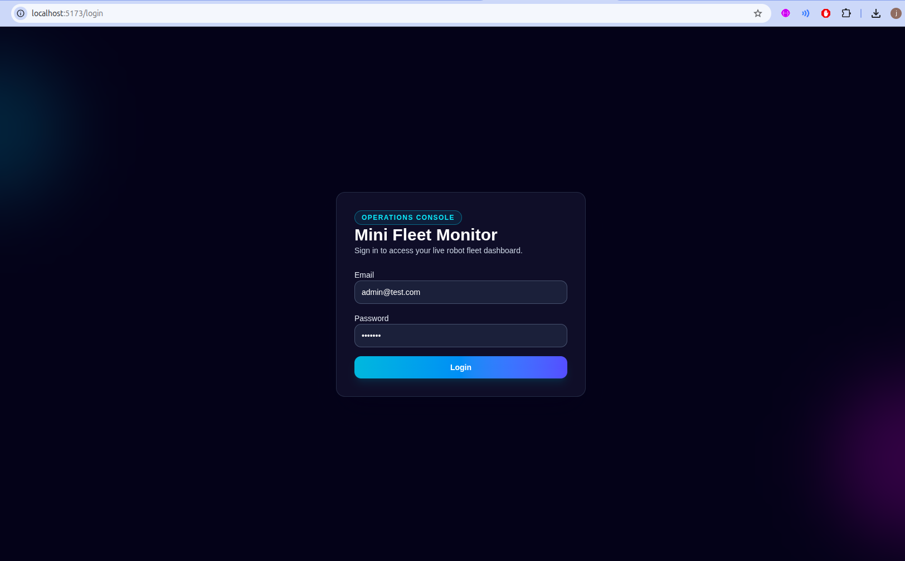
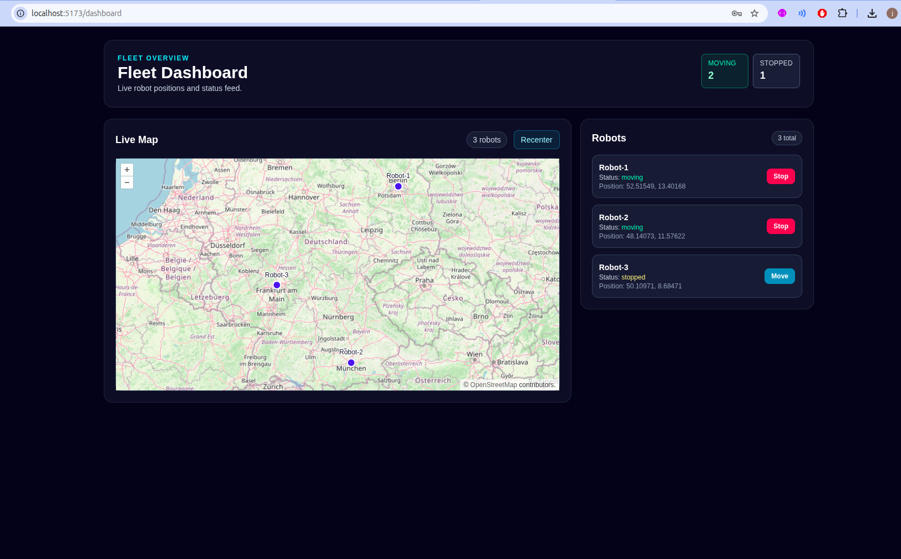

# Mini Fleet Monitor

This project is a full-stack mini fleet monitor with JWT login, protected robot APIs, PostgreSQL persistence, Redis caching support, and live robot updates over WebSocket to a React + OpenLayers dashboard.

## Setup

### 1) Prerequisites
- Docker
- Docker Compose (`docker compose` or `docker-compose`)

### 2) Start all services
From the project root:

```bash
docker compose up --build
```

This starts:
- `api` (Node.js/Express) on `http://localhost:4000`
- `db` (PostgreSQL) on `localhost:5433`
- `redis` on `localhost:6379`
- `frontend` (React/Vite) on `http://localhost:5173`

### 3) Sample login user
- Email: `admin@test.com`
- Password: `test123`

The backend seeds this user automatically on startup.

### 4) Quick verification checklist
- Open frontend: `http://localhost:5173`
- Login with `admin@test.com` / `test123`
- Confirm dashboard loads with robot list + map markers
- Wait a few seconds and confirm robot positions update live

## Architecture (Short)

The backend is an Express API connected to PostgreSQL through Prisma and to Redis for short-lived caching, with JWT-based auth protecting robot endpoints and a simulation timer updating robot positions every 2 seconds; updates are broadcast to connected clients via WebSocket. The frontend is a React app with route protection and OpenLayers map rendering, fetching initial robot data through REST and then applying live position/status updates from the websocket stream.

## Sample Screenshots

Place screenshots in a `screenshots/` folder at project root and keep these filenames:

- Login page: `screenshots/login.png`
- Dashboard map with robots: `screenshots/map-robots.png`

Example markdown embedding (already wired once files exist):




## Troubleshooting

- **Frontend not reachable**: run `docker compose up --build` and confirm `frontend` is running.
- **Port conflict**: free ports `5173`, `4000`, `5433`, and `6379`, then restart Compose.
- **Clean restart**: run `docker compose down -v` then `docker compose up --build`.
